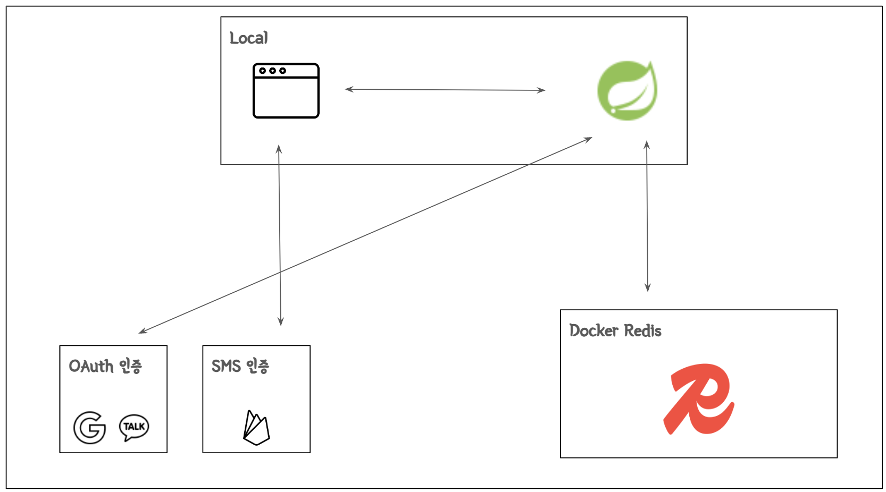

## Status: Developing

### 서비스 구조
<strong> 초기 구상 (작업중...) </strong>

- OAuth, JWT
  - 토큰을 사용한 인증, 인가 흐름 구현
- 사용자 정보 third-party 서버에 저장
- 사용자 정보 Redis 저장
- Local 환경으로만 구성

<strong> 2차 구상 </strong>

- JWT를 활용한 java-jwt 인증 API 개발
- 분산 서버에서 사용자 인증 관리
  - AWS 환경 인프라 Lite한 구성
  - 내부망(Private)과 외부망(Public) 통신
- JMeter 사용 트래픽 테스트

---
### 개발 범위
<strong> 1차 (작업중...) </strong>

- 가벼운 Web browser 랜딩 페이지 구현
  - 홈 화면
  - 로그인 화면
  - 마이데이터 화면
  - About 화면
- 회원가입/로그인 기능 구현
  - kakao, google
  - firebase 전화번호
- 사용자 정보 CRUD

<strong> 2차 </strong>

- java-jwt 기능 구현
- AWS 인프라 구축
- 사용자 트래픽에 따른 웹 서버 설정

### 사용한 기술 스택

